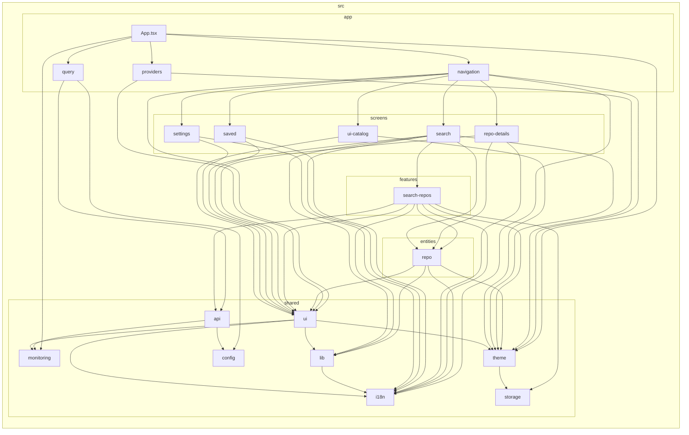

# Architecture graph

Generated by `yarn arch:graph` from the real imports (ADR-0022). Do not edit by hand.
Nodes are slices; arrows point from the importer to what it imports.

```mermaid
flowchart LR

subgraph 0["src"]
subgraph 1["app"]
2["App.tsx"]
3["navigation"]
4["providers"]
5["query"]
end
subgraph 6["entities"]
7["repo"]
end
subgraph 8["features"]
9["search-repos"]
end
subgraph A["screens"]
B["repo-details"]
C["saved"]
D["search"]
E["settings"]
F["ui-catalog"]
end
subgraph G["shared"]
H["api"]
I["config"]
J["i18n"]
K["lib"]
L["monitoring"]
M["storage"]
N["theme"]
O["ui"]
end
end
2-->3
2-->4
2-->5
2-->L
2-->N
3-->N
3-->B
3-->C
3-->D
3-->E
3-->F
3-->J
3-->O
4-->N
4-->O
5-->H
5-->I
7-->J
7-->K
7-->N
7-->O
9-->7
9-->H
9-->K
9-->M
9-->J
9-->O
9-->N
B-->7
B-->J
B-->O
C-->J
C-->O
D-->7
D-->9
D-->J
D-->K
D-->O
D-->N
E-->J
E-->O
F-->N
F-->O
H-->I
H-->L
K-->J
N-->M
O-->N
O-->L
O-->J
O-->K
```
